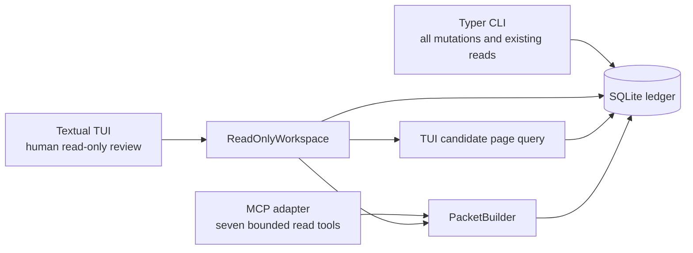

# Technical Design: WorkTrace Read-Only Human TUI

**Status**: Accepted and implemented for the original read-only review journey

**Author**: Hisham (Tech Lead)

**Date**: 2026-08-30

**PRD**: [WorkTrace Read-Only Human TUI](../prds/worktrace-read-only-human-tui.md)

**Tracking**: [#8](https://github.com/AmrMohamad/WorkTrace/issues/8)

**Delivery**: The design merged in [PR #13](https://github.com/AmrMohamad/WorkTrace/pull/13) and
the complete original vertical slice merged in [PR #16](https://github.com/AmrMohamad/WorkTrace/pull/16).
The #22 evidence-search addendum below is an accepted implementation contract, not a statement that
search has shipped.

## Overview

### Summary

WorkTrace will add `worktrace ui`, a keyboard-first Textual workstation for reviewing one
contribution from application selection through a bounded evidence excerpt. The first release is
structurally read-only: it receives configuration and short-lived query-only SQLite connections,
but no provider, network, write, migration, maintenance, export, backup, purge, or configuration
editing capability.

The executable TUI was delivered after the Phase 4 v2 packet correction and a separate
generation-bound candidate query. At that original baseline, existing CLI commands and all six MCP
tools, including MCP's opaque `offset:` cursors, remained unchanged. The current MCP contract is
recorded below.

### Goals

- Complete the approved application-to-evidence review journey at 80x24 and 120x40.
- Keep the packet builder as the canonical claim projection and derive gaps from the same packet.
- Bound candidate-page work without replacing the existing CLI or MCP candidate APIs.
- Make provider and stored text safe for literal terminal presentation without changing persisted
  or searchable evidence.
- Enforce the read-only authority boundary through the capabilities constructed for the TUI.
- Package the Textual dependency and TCSS resource in the installed wheel.

### Non-goals

- TUI imports, decisions, attestations, rebuilds, migrations, exports, backups, purges, or config
  editing.
- Jira, GitLab, local Git, HTTP, socket, background synchronization, database watching, or daemon
  access from the TUI.
- Calling WorkTrace CLI commands as subprocesses, parsing CLI JSON, or calling MCP internally.
- Changing the current MCP tool count, schemas, bounds, response envelope, or `wtc1:` cursor.
- Persistent UI preferences, a generic service framework, or a new materialized candidate index.
- General evidence-body, packet, title, error, URL, or screenshot capture actions.

## Governing decisions

- [AgDR-0005](../agdr/AgDR-0005-read-only-textual-review-workstation.md) selects Textual and the
  capability-enforced, read-only runtime boundary.
- [AgDR-0006](../agdr/AgDR-0006-phase4-v2-packet-compatibility.md) defines the deliberate Phase 4
  v2 packet correction that must merge before the TUI.
- [AgDR-0007](../agdr/AgDR-0007-agent-evidence-workflow-migration.md) supersedes the original
  six-tool/`offset:` MCP constraint without changing the TUI's separate read-only authority.
- The approved PRD owns the user journey and interaction requirements. This document owns the
  implementation boundaries and delivery sequence.

### Current MCP contract

The shipped MCP server now exposes seven bounded, read-only tools. Its candidate and evidence
traversals use `wtc1:` cursors bound to application, collection, filters, view, and continuation
position; a legacy `offset:` cursor reports an upgrade/restart requirement. This design's original
six-tool language remains historical context only. The TUI neither invokes the CLI nor calls MCP,
and #22 does not change MCP schemas, limits, or cursor formats.

## Architecture

### Components and authority



`ReadOnlyWorkspace` is a narrow composition root, not a general application-service layer. It is
the only object the TUI constructs for WorkTrace data access. It may use pure configuration and
read-model helpers, but it receives no repository writer, adapter, HTTP client, importer, decision
writer, migration operation, or maintenance operation.

Import purity is not the enforcement mechanism. Existing modules have transitive imports and a
broad refactor solely to make an import graph look pure would add risk without removing a
capability. Tests instead prove the objects constructed by the TUI cannot write the ledger, obtain
provider credentials, open a socket, or create files.

### Public entry point

The Typer adapter adds only:

```console
worktrace ui
worktrace ui --app APP_ID
worktrace ui --app APP_ID --candidate CANDIDATE_ID
```

Rules:

- `--candidate` requires `--app`.
- The candidate must resolve inside that application.
- Both standard input and standard output must be TTYs. Otherwise the command exits 2 with stable
  CLI guidance before importing Textual.
- Existing no-argument help and JSON command output do not change.
- Missing or invalid configuration and a missing database produce CLI instructions; the TUI does
  not create or repair either.

Before importing `worktrace.tui` or Textual, the command removes these variables from the current
process environment:

```text
WORKTRACE_JIRA_BASE_URL
WORKTRACE_JIRA_EMAIL
WORKTRACE_JIRA_API_TOKEN
WORKTRACE_GITLAB_BASE_URL
WORKTRACE_GITLAB_TOKEN
WORKTRACE_EMAIL_HMAC_KEY

TEXTUAL
TEXTUAL_DEBUG
TEXTUAL_DRIVER
TEXTUAL_LOG
TEXTUAL_DEVTOOLS_HOST
TEXTUAL_DEVTOOLS_PORT
TEXTUAL_PRESS
TEXTUAL_SCREENSHOT
TEXTUAL_SCREENSHOT_LOCATION
TEXTUAL_SCREENSHOT_FILENAME
```

This keeps provider credentials and Textual's environment-driven logging, alternate drivers,
automatic input, and screenshot behavior outside the TUI route. It is a process-local defense in
depth control, not protection from an authorized user who can inspect their own process or screen.

## Read model

### `ReadOnlyWorkspace`

The bounded read-model PR introduces this interface:

```python
class ReadOnlyWorkspace:
    def applications(self) -> tuple[ApplicationSummary, ...]: ...
    def source_status(self, app_id: str) -> dict[str, object]: ...
    def candidate_page(
        self,
        app_id: str,
        *,
        page_size: int,
        cursor: CandidateCursor | None,
    ) -> CandidatePage: ...
    def contribution_review(self, identifier: str) -> ContributionReview: ...
    def evidence_excerpt(
        self,
        evidence_id: str,
        *,
        max_chars: int,
    ) -> dict[str, object]: ...
```

Each operation opens its SQLite connection inside the Textual worker that invokes it, uses it for
one bounded operation, and closes it in `finally`. No connection crosses threads or remains open
while the user is idle.

`contribution_review()` resolves the contribution once, builds one Phase 4 packet, and derives the
gap response from that exact packet. It does not independently rebuild a summary, packet, and gap
report. `PacketBuilder` remains the canonical claim projection; `WorkTraceTools` remains an MCP
adapter and is not reused by the TUI.

### Database readiness and connection contract

The TUI connection uses SQLite URI `mode=ro`, verifies `PRAGMA query_only = ON`, and sets a
500-millisecond busy timeout. The existing default 10-second timeout remains unchanged for other
callers.

Initial readiness opens one read-only connection and compares `PRAGMA user_version` with the
current packaged migration version without invoking `migrate()`:

- equal: continue;
- older: exit with instructions to run `worktrace init` through the CLI;
- newer: exit with an incompatible-database message; and
- missing or unreadable: report the path and a safe next action.

The TUI never creates the database and never applies a migration. Lock contention is translated to
a sanitized `WorkTrace data is busy` state with Retry and Return actions rather than waiting ten
seconds.

### Source status

The UI renders the existing latest-attempt read model honestly. For each configured source instance
it may show:

```text
status
completeness
completed_at
stale
authoritative_current
error_summary
limitations
```

Every dynamic value is terminal-encoded before display. The UI does not label a timestamp `Last
complete` and does not claim `Previous snapshot retained`; proving a retained authoritative
snapshot requires a separate future query.

### Generation-bound candidate paging

The TUI uses a new query under `worktrace.read_models`, not
`PacketBuilder.list_candidates()` and not the MCP cursor codec:

```python
@dataclass(frozen=True, slots=True)
class CandidateCursor:
    generation_token: str
    after_candidate_id: str


@dataclass(frozen=True, slots=True)
class CandidatePage:
    generation_token: str | None
    items: tuple[CandidateListItem, ...]
    next_cursor: CandidateCursor | None
```

`CandidateListItem` contains only candidate ID, confirmed contribution ID when present, title and
title provenance, contribution type, status, period, source coverage, and high-level participation
indicators. Full packets and gap counts are not built for table rows.

The page operation runs in one short read transaction:

1. Read the active generation's `generated_at` and `generator_version` for the application.
2. Reject mixed active-generation metadata as inconsistent.
3. Hash `app_id`, `generated_at`, and `generator_version` into the generation token. Do not run
   `COUNT(*)` and do not include a count in the cursor.
4. For a supplied cursor, compare its token with the active token. A mismatch raises
   `CandidateGenerationChanged`.
5. Scan only that exact generation ordered by candidate ID using `id > after_candidate_id`.
6. Advance the scan cursor for every raw candidate examined, including ignored or unavailable
   candidates.
7. Project until the visible page is full, the generation ends, or the scan budget is exhausted.

Bounds:

```text
default page size    25
maximum page size    50
batch size           2 x requested page size
scan budget          min(4 x requested page size, 200)
```

An empty application returns no generation token and no cursor. Budget exhaustion may return a
short visible page with a continuation cursor. The cursor points to the last raw candidate scanned,
preventing skipped rows from creating loops. Scan and projection counts are internal test
diagnostics, not public DTO fields.

No index or migration is part of this design. The implementation records the query plan, rows
scanned, projection count, median local time, and p95 local time on a deterministic 3,000-candidate
fixture. A separate performance issue may propose an index only if evidence shows it is necessary.

This query guarantees page-internal consistency and no duplicate raw rows while candidate
generation and decision state remain unchanged. A separate CLI process may change decision
projections between pages; explicit Refresh clears the cursor stack and restarts at page one.

### Phase 4 v2 prerequisite

The Phase 4 v2 PR moves the canonical 30-question inventory to
`worktrace.packets.schema`, adds `schema_version: 2`, and preserves the current packet envelope:

```text
schema_version
contribution
as_of
source_status
evidence_summary
sections
participation
release_ladder
contradictions
defensibility
limitations
```

`as_of` remains the newest evidence timestamp represented by the contribution. Contribution dates
remain `date_from` and `date_to`. Gaps remain a separately derived response and are not duplicated
into the packet. The TUI iterates the returned sections; it does not hard-code a question count or
maintain a second question inventory.

## Terminal presentation and disclosure boundary

### Presentation encoder

`worktrace.tui.terminal_text` is presentation policy, not evidence normalization. It returns the
encoded text, encoded-control count, and terminal-truncation flag. Stored and searchable evidence
does not change.

The encoder:

- preserves ordinary Unicode and newline;
- expands tab to four spaces;
- visibly encodes every other C0 control, ESC, DEL, C1 control, U+2028, U+2029, and lone
  surrogate;
- visibly names bidi controls U+061C, U+200E, U+200F, U+202A-U+202E, and U+2066-U+2069;
- retains legitimate ZWJ and ZWNJ behavior; and
- enforces its output bound with a running output-length counter, including replacement expansion.

Evidence-excerpt truncation and terminal-presentation truncation are separate fields and separate
labels. Dynamic values from configuration, SQLite, providers, stored errors, titles, actor names,
paths, modules, IDs displayed as prose, limitations, and notifications all pass through the
encoder. Static source-controlled UI strings do not.

### Literal-renderable sink rule

Encoding controls is necessary but does not disable Rich markup. Every encoded dynamic value must
therefore cross one literal-renderable sink before it reaches Textual:

```python
def literal_dynamic_text(value: str) -> Text:
    encoded = terminal_safe_text(value)
    return Text(encoded.text)
```

`Text(encoded.text)` is constructed as plain text and does not call `Text.from_markup`. Dynamic
`DataTable`, tree, list, option, label, and other renderable cells receive this `Text` value, never
a bare `str`. Dynamic widget updates, modal titles and bodies, errors, and notifications must use a
`Text` renderable, `markup=False`, or another API that explicitly treats the value literally. If a
Textual/Rich API accepts only a markup-capable string and has no literal mode, it may receive only
fixed source-controlled text; the dynamic detail must be shown in a separate literal renderable.

Passing encoded dynamic content as a bare `str` to any markup-capable Textual/Rich API is
forbidden. Dynamic text is also never used to construct widget IDs, CSS selectors, bindings,
action names, command names, or command-palette entries. Provider excerpts use a scrollable
`Static(literal_dynamic_text(value), markup=False)` as their literal renderer, never Markdown or
Rich markup. `Static` is not assumed to be non-selectable; selection and inherited copy behavior
are disabled by the screen policy below.

The UI displays an encoded presentation value but retains the original DTO value separately. A
clipboard action validates and copies the original stable ID exactly; it never copies the encoded
label or any adjacent dynamic text.

### Clipboard, URLs, and screenshots

`WorkTraceApp` sets `ALLOW_SELECT = False`. Every normal and modal WorkTrace screen also inherits
one selection policy that sets `ALLOW_SELECT = False`, removes the inherited
`ctrl+c`/`super+c -> screen.copy_text` bindings, and overrides `action_copy_text()` as a no-op. The
root screen, application selector, candidate browser, contribution screen, evidence modal, help,
and error surfaces all use this policy. The no-op action is defense in depth if an inherited or
future binding still dispatches `screen.copy_text`; no selected text may reach
`App.copy_to_clipboard`.

Only a value that passes the WorkTrace stable-ID validator may reach `copy_to_clipboard`. The UI
offers no application action to copy evidence bodies, packets, errors, titles, or provider URLs.
Provider URLs are neither clickable nor opened. The explicit stable-ID action is separate from
`screen.copy_text`, validates the original DTO value, and copies that exact ID.

The command palette is an exact static allowlist and does not call Textual's default system-command
provider. It contains only Quit, keyboard help, Switch application, Refresh, and Return to
candidates when contextually valid. There is no screenshot command.

These controls reduce accidental disclosure. They do not prevent operating-system screenshots,
terminal-emulator selection outside Textual's application actions, photography, terminal logging,
or other actions by the authorized local user.

## TUI behavior

### Surfaces

The executable vertical slice has only four surfaces:

1. **Application Selection**: one configured application opens automatically; multiple
   applications produce a keyboard-operable list.
2. **Candidate Browser**: latest source attempts, one bounded candidate page, a single candidate
   authority notice, and next/previous cursor navigation.
3. **Contribution Review**: Summary, Evidence, Participation, Delivery, and Questions tabs from one
   `ContributionReview` DTO.
4. **Evidence Excerpt**: bounded, literal, scrollable, non-clickable, and labelled
   `UNTRUSTED SOURCE TEXT`.

Summary exposes title authority, stable IDs, current and unsupported members, source coverage, and
contradictions. Evidence groups current and unsupported records by source. Participation preserves
role-specific facts and other contributors without inferring ownership. Delivery renders all seven
independent rungs. Questions renders every returned Phase 4 question once and presents its answer,
support, contradiction, limitation, and gap explanation from the same packet-derived result. The
excerpt modal shows source, kind, evidence ID, observation time, completeness, and separate source
and terminal truncation states.

There is no dashboard-only shell. `worktrace ui` becomes public only in the PR that supplies the
complete journey.

### Layout

At 80x24 the UI uses one primary pane and drill-down navigation. At 120x40 the candidate screen may
add a selected-row preview and contribution evidence may place selection and detail side by side.
The larger layout adds context, never exclusive information or actions.

Below 80x24 the UI offers Continue in compact mode, Recheck, or Quit. Compact mode removes optional
columns and previews but keeps the complete drill-down journey.

### Keyboard contract

```text
?       context help
Ctrl+P  fixed safe command palette
a       switch application
r       refresh and restart pagination
q/Esc   back; quit at root
Ctrl+Q  quit
y       copy selected validated stable ID
j/k     move selection
Enter   open
n/p     next/previous candidate page
1-5     Summary/Evidence/Participation/Delivery/Questions
```

All actions are keyboard accessible, mouse use is optional, focus is visible, and every state uses
text or a symbol plus text rather than color alone. A fresh-process test covers `NO_COLOR`. The TUI
does not claim full screen-reader accessibility; the CLI JSON and MCP responses remain the
structured alternatives.

## Worker and state model

Every SQLite operation runs in a Textual thread worker. The worker constructs the connection,
builds an immutable DTO, posts a thread-safe message, and closes the connection. Widgets are
updated only on the UI thread.

Each request carries a monotonically increasing request ID. Screens discard results whose request
ID is no longer current. Exclusive workers prevent obsolete UI updates but are not described as
cancelling a SQLite statement that has already begun. No network work exists in this release.

UI state remains in memory and contains only the current app, screen, selected stable IDs, current
page, cursor history, request IDs, and compact-mode choice. It does not persist evidence, drafts,
credentials, URLs, or preferences.

## Evidence discovery addendum — [#22](https://github.com/AmrMohamad/WorkTrace/issues/22) implementation contract, not implemented

`ReadOnlyWorkspace.search_evidence()` will return frozen page, result, link, and TUI-search-cursor
DTOs. Each completed page retains successfully submitted parameters, returned results,
continuation, read revision/read-model version, readiness, and link limitations. A result carries
stable observation/object IDs, source/kind, bounded title/period metadata, and canonical links. The
cursor binds app, submitted filters, revision, read-model version, and the final scanned
freshness/observation-ID key. It is a separate TUI type: neither candidate-browser nor MCP cursor
formats change. The screen renders a result table, a separate selected-result canonical-link list,
and literal status text for submitted filters, page state, and link-coverage limitations.

The caller validates the required query (trimmed, 1–500 characters, no NUL), optional source
(`git`, `jira`, `gitlab`, or `manual`), optional module text (trimmed, 1–200 characters, no NUL),
inclusive ISO dates, and date order before starting a worker. One worker-local `mode=ro`,
`query_only`, 500-ms-busy-timeout SQLite snapshot covers scope, cursor/revision validation, current
evidence selection, canonical enrichment, readiness, and limitations; it closes before the DTO
returns to the event loop. Changing filters starts at the first key; a changed revision invalidates
the traversal.

The implementation reuses the existing scanner: no more than 200 raw current-observation rows are
scanned, at most 20 eligible results are returned, and order is freshness then observation ID. It
keeps the scanner's literal, case-insensitive title/body/data search and literal module-data match;
module text is neither classification nor ranking. Activity dates, rather than fetch/freshness
dates, decide inclusion. Undated evidence is included without date filters and excluded with them,
with that exclusion reported. A continuation can follow a short or empty result page.

Canonical enrichment reuses the membership/lineage interpretation: locate generated/exact accepted
decision candidates, resolve aliases, deduplicate canonical identities, and project only effective
material/context members. At most 50 **distinct canonical projections** are attempted over the
whole page, including attempts yielding no effective link. Allocate that budget across results;
reuse a projection only within this snapshot; cap one result at five links. Projection exhaustion or
the display cap marks coverage incomplete without inventing a total, differentiating complete no-link,
partial verified-link, and incomplete no-link outcomes. It adds neither an index nor a persistent
cache. The 50 count is canonical projection work only, while broader authority and decision-context
costs remain separately measurable. `contribution_review()` must resolve a canonical, in-scope
confirmed contribution and build its packet in the same snapshot even when no generated candidate
remains; confirmed status comes from active lineage while applicable generated-candidate statuses
remain preserved; removed, ignored, or out-of-scope targets return recoverable errors.

`/` from a settled candidate browser pushes the search screen and focuses query. The explicit Search
action/Enter from form fields starts work; Tab moves form, results, and link list; Enter opens an
excerpt for a result or contribution review for a link. Back/review and Back/search restore the
same selected search/candidate contexts, global Return reveals the original candidate instance, and
application switching uses stack normalization. The state model separately stores drafts, submitted
filters, displayed page/selection, committed cursor history, and pending request. Only the matching
successful request commits state; paging is ignored while pending, as are stale/closed/other-app
responses. `n`/`p` next/previous actions work only outside editable focus and against this committed
history; a matching successful response changes the page and its history together. Ordinary errors
retain the displayed page. Invalidation clears selectable rows and links,
restarts once, then exposes a recoverable empty Retry state if that restart fails. Compact form
scrolling at 80x24 and more rows at 120x40 preserve this behavior; editable fields retain printable
keys as text.

The existing literal terminal rendering and `ALLOW_SELECT = False` policy applies to filters,
status, links, errors, and modal content. Search exposes evidence only through the bounded excerpt
modal and stable IDs only through the validated explicit copy action. It introduces no provider,
subprocess, write, configuration, export, history, or refresh capability.

## Packaging

The complete TUI PR adds `textual>=8.2.8,<9` and updates `uv.lock`. It explicitly includes
`worktrace/tui/worktrace.tcss` in the wheel through Hatchling configuration and verifies the
resource with `importlib.resources` after isolated installation.

No `textual-dev` dependency or snapshot-test plugin is added in the first release. Behavioral and
DOM assertions use Textual's built-in `run_test()` and `Pilot` support.

## Error handling

User-facing failures state what happened, why the review is limited, what was not changed, and the
next safe action. Dynamic error content is terminal-encoded and bounded. Expected states include:

- non-TTY invocation;
- missing or invalid configuration;
- missing, older, or newer database;
- database busy;
- no applications or no candidate generation;
- candidate generation changed;
- stale worker result;
- unavailable or unsupported-current evidence; and
- evidence and terminal truncation occurring independently.

Unexpected exceptions do not include evidence bodies or credentials in logs or notifications.

## Delivery plan

| Order | Issue | Deliverable | Dependency |
|---|---|---|---|
| 1 | [#9](https://github.com/AmrMohamad/WorkTrace/issues/9) | Phase 4 v2 schema and packet compatibility correction | This design approved |
| 2 | [#10](https://github.com/AmrMohamad/WorkTrace/issues/10) | Generation-bound candidate query and read-only connection/readiness support | #9 merged |
| 3 | [#11](https://github.com/AmrMohamad/WorkTrace/issues/11) | Complete Textual vertical slice, packaging, security boundary, and interaction tests | #9 and #10 merged |

Each issue has one implementation owner and one independently reviewed PR. The TUI is not exposed
in an incomplete shell PR.

## Testing strategy

### Phase 4 contract

- Exactly 30 unique v2 question IDs appear once and in documented order.
- Runtime and documentation use the same inventory; the UI parity test does not derive expected
  and actual values from the same UI constant.
- `action.review` uses self-participations classified as `reviewed`.
- Review-only evidence no longer supports `action.coordination`.
- Every non-null material answer retains stable evidence citations; unknown and unresolved answers
  remain null.
- CLI packet output and MCP packet output expose v2 while command and tool schemas remain stable.
- At the original packet-correction baseline, MCP continued to accept and return its existing opaque
  `offset:` cursor; the current MCP cursor contract is documented above.

### Candidate query

- Default pages return at most 25 visible items and scan at most 100 raw rows; no allowed request
  scans more than 200.
- Projection count never exceeds the scan budget.
- Cursor advancement uses the last raw ID scanned.
- Stable generations produce no duplicate or omitted raw rows.
- Ignored/unavailable candidates do not loop; short pages continue correctly.
- Empty generations and generation invalidation are explicit.
- The query does not materialize or project the complete candidate table.
- A deterministic 3,000-candidate fixture records query-plan and local timing evidence without a
  fragile CI wall-clock gate.

### Authority and security

- Every connection is worker-local, `mode=ro`, query-only, uses a 500-millisecond busy timeout,
  closes in `finally`, and rejects a real write.
- Provider credential accessors, adapter/client constructors, socket connections, and file writes
  are not reached in TUI journeys.
- Managed database and data-directory contents are unchanged before and after journeys.
- Environment scrubbing occurs before Textual import.
- The command palette contains only approved commands and no screenshot/log/export file appears.
- Only validated stable IDs invoke the clipboard.
- The terminal corpus covers CSI, OSC 8/52, DCS, ST/BEL termination, C0/C1, CR, BS, DEL,
  U+2028/U+2029, bidi controls, lone surrogates, Rich/action markup, prompt-injection text, and
  output-expansion bounds. No dangerous raw control survives.
- Candidate rows plus representative tree/list cells, modal titles and bodies, source errors, and
  notifications render `[bold]`, `[@click=...]`, and link markup visibly as text. Their Rich
  renderables contain no markup-derived spans or links, and interaction creates no actions,
  commands, or bindings.
- Tests fail if encoded dynamic content is passed as a bare `str` to a markup-capable cell or
  widget update instead of the literal-renderable helper or an explicit literal API.
- `WorkTraceApp` and every normal and modal screen report `ALLOW_SELECT = False`; screens have no
  effective `ctrl+c`/`super+c -> screen.copy_text` binding and retain a no-op
  `action_copy_text()`.
- A `Pilot` mouse-selection attempt over an evidence excerpt followed by `ctrl+c` and `super+c`
  leaves the clipboard unchanged and never calls `copy_to_clipboard`; the explicit validated-ID
  action still invokes it once with the exact stable ID.

### Interaction and packaging

- One-app, multi-app, missing-state, deep-link, paging, refresh, generation-change, database-busy,
  contribution-tab, and evidence-excerpt journeys run through `run_test()` and `Pilot`.
- Stale worker results are ignored.
- Keyboard-only journeys pass at 80x24 and 120x40.
- `NO_COLOR` is verified in a fresh process with visible text/symbol states and focus.
- Synthetic fixtures only are used for UI tests.
- The built wheel passes `worktrace ui --help`, non-TTY rejection, module import, and TCSS resource
  checks in an isolated environment.
- Existing CLI and MCP regressions remain green.

Final verification for each code PR remains:

```text
uv run pytest
uv run coverage run -m pytest
uv run coverage report
uv run ruff format --check .
uv run ruff check .
uv run mypy src
uv build
isolated wheel smoke
```

Synthetic tests do not establish live Jira, GitLab, proprietary-repository, or real-terminal
accessibility parity.

## Risks and mitigations

| Risk | Mitigation |
|---|---|
| TUI gains accidental mutation or network authority | Construct only `ReadOnlyWorkspace`; prove real write, credential, socket, and file attempts are unreachable |
| Candidate page still scales with total history | Generation keyset scan, fixed budget, projection diagnostics, and 3,000-row fixture |
| Rebuild occurs during navigation | Generation token mismatch clears cursor history and restarts page one |
| Provider text changes terminal state or impersonates chrome | Central presentation encoder, `markup=False`, fixed commands/identities, adversarial corpus |
| Screenshot or clipboard action leaks bulk evidence | No screenshot command; stable-ID-only clipboard; explicit residual-risk wording |
| Packet and UI question inventories drift | One schema under `worktrace.packets`; packet-to-UI parity test |
| Thread worker result overwrites newer state | Monotonic request IDs and UI-thread stale-result rejection |
| Installed wheel lacks styles | Explicit TCSS inclusion and isolated resource smoke test |

## Open questions

No implementation-blocking question remains. Any future TUI mutation, import, maintenance,
configuration editing, persistent preference, database watching, writer-lock, backup, or WAL change
requires a successor authority decision and is outside issues #9-#11.

## Approvals

| Role | Name | Date | Status |
|---|---|---|---|
| Tech Lead | Hisham | 2026-08-30 | Author |
| Solution Architect | Tariq | — | Pending independent review |
| Security Auditor | — | — | Pending independent review |
| UI design | — | — | Pending independent review |
